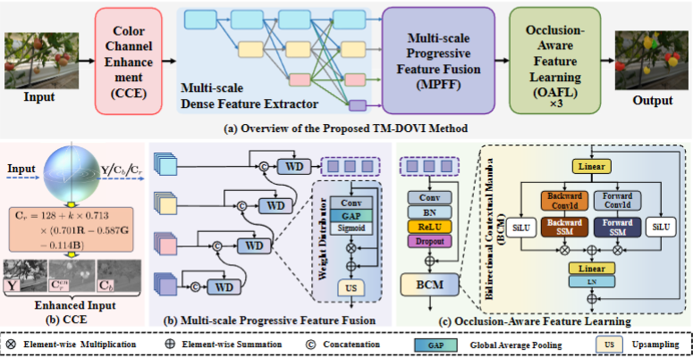

# [TM-DOVI] tomato maturity detection of segmentation

## A Robust Tomato Maturity Detection Method Against Occlusion and Variable Illumination

*****
## Requirements
Python                  3.9.19  
torch                   2.4.1  
torchvision             0.19.1  
mamba-ssm               2.2.4   
numpy                   1.23.5  
matplotlib              3.9.2  
tqdm                    4.65.2  
einops                  0.8.0  
causal-conv1d           1.5.0.post8  

*****
## Data preparation
- Laboro Tomato: Download this dataset from [Laboro](https://github.com/laboroai/LaboroTomato)
- Yu Tomato: Download this dataset from [Yu](http://dx.doi.org/10.57760/sciencedb.j00001.00946)
*****
## Get start
- Train
Running > train.py
- Test
Running predict.py
****
## Pretrained Models
Model Weights
****
| Datasets       | Link                                 |
|-------------|--------------------------------------------------|
| Labora Tomato   |  |
| Normal light  | [Google Drive](https://drive.google.com/file/d/1eu6-y-zY43Iw235Je_JWpHrPGxaiwpi-/view?usp=drive_link) |
| Artificial light  | [Google Drive](https://drive.google.com/file/d/1cMIuH_4v21uzWFNx_jo2I04AxcodpZGn/view?usp=drive_link) |
| Faint light   | [Google Drive](https://drive.google.com/file/d/1XgTTpOkpkGRjr4DHq4mNAoeq0Ir32TLb/view?usp=drive_link) |
| Sodium yellow light    | [Google Drive](https://drive.google.com/file/d/1JY4HlUZ8qL5vhcYERp5ZqJfHJkVYPXGz/view?usp=drive_link) |

## Acknowledgement
We are very grateful for these excellent works [Hrnet](https://github.com/bubbliiiing/hrnet-pytorch)、[Vision mamba](https://github.com/hustvl/Vim), which have provided the basis for our framework.
*****
## Citation
